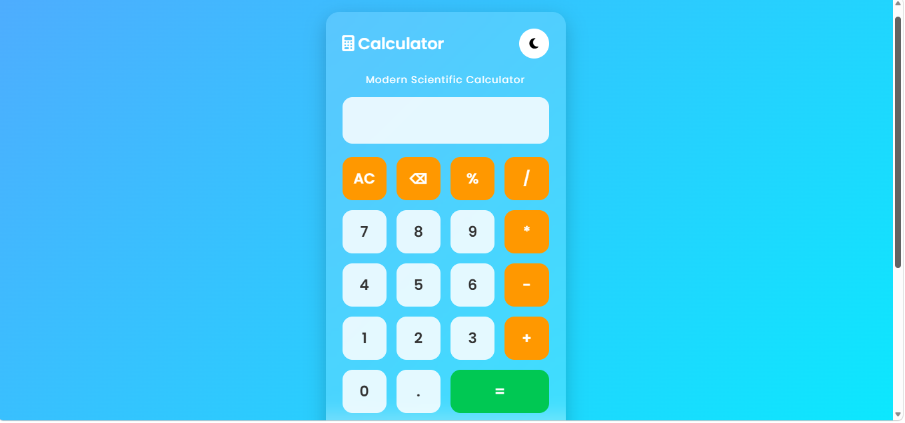
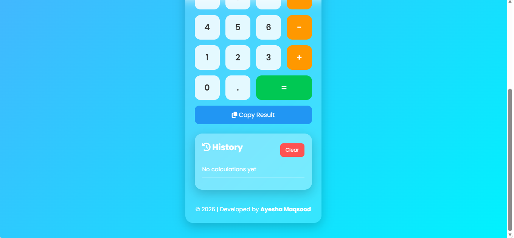

# 🧮 CodeAlpha Calculator

A modern responsive calculator built using **HTML, CSS, and JavaScript** as part of the **CodeAlpha Frontend Development Internship**.

## ✨ Features

- ➕ Addition
- ➖ Subtraction
- ✖️ Multiplication
- ➗ Division
- 📊 Percentage
- ⌫ Backspace
- 🧹 Clear (AC)
- 🌙 Dark / Light Mode
- ⌨️ Keyboard Support
- 📜 Calculation History
- 🗑️ Clear History
- 📋 Copy Result
- 📱 Responsive Design

---

## 🛠 Technologies Used

- HTML5
- CSS3
- JavaScript

---

## 📸 Screenshot

---

## 👩‍💻 Developed By

**Ayesha Maqsood**

BS Information Technology Student

CodeAlpha Frontend Development Intern